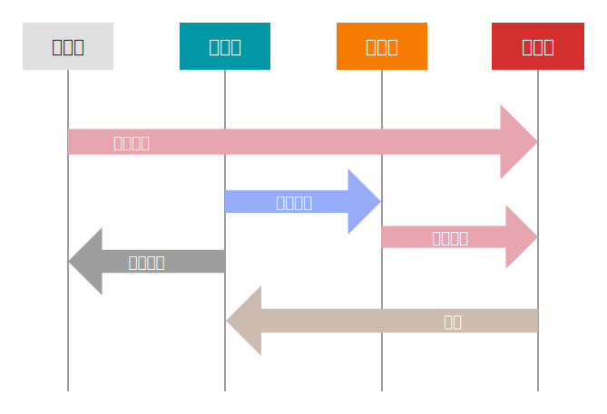

# 管理暂存区

> 本节部分内容参考自 [Pro Git](https://git-scm.com/book/zh/v2/Git-%E5%9F%BA%E7%A1%80-%E8%AE%B0%E5%BD%95%E6%AF%8F%E6%AC%A1%E6%9B%B4%E6%96%B0%E5%88%B0%E4%BB%93%E5%BA%93) 和 [git-recipes](https://github.com/geeeeeeeeek/git-recipes/blob/master/sources/2.4-%E6%9F%A5%E7%9C%8B%E4%BB%93%E5%BA%93%E7%8A%B6%E6%80%81.md)，在原文基础上有一定修改。

在开始之前，先上一张图：



看完这张图，我相信你已经懂了。你可以跳过下面的内容继续看下一节了。

## 文件的状态变化周期

工作目录下的每一个文件都不外乎两种状态：**已跟踪 (tracked)** 或 **未跟踪 (untracked)**。已跟踪的文件是指那些被纳入了版本控制的文件，在上一次快照中有它们的记录，在工作一段时间后，它们的状态可能是**未修改 (unmodified)**，**已修改 (modified)** 或**已暂存 (staged)**。简而言之，已跟踪的文件就是 Git 已经知道的文件。

工作目录中除已跟踪文件外的其它所有文件都属于未跟踪文件，它们既不存在于上次快照的记录中，也没有被放入暂存区。初次克隆某个仓库的时候，工作目录中的所有文件都属于已跟踪文件，并处于未修改状态，因为 Git 刚刚签出了它们，而你尚未编辑过任何东西。

编辑过某些文件之后，由于自上次提交后你对它们做了修改，Git 将它们标记为已修改文件。在工作时，你可以选择性地将这些修改过的文件放入暂存区，然后提交所有已暂存的修改，如此反复。

总结一下，**在 Git 中，正常的文件状态变化周期是：在已跟踪的三种状态（未修改、已修改、已暂存）中不断循环，或者进入和退出未跟踪状态。**

## 查看文件状态

### git status

`git status` 命令显示工作目录和暂存区的状态。你可以看到哪些更改被暂存了，哪些还没有，以及哪些还未被 Git 追踪。

```
$ git status
On branch 管理暂存区
Changes to be committed:
  (use "git restore --staged <file>..." to unstage)
        new file:   src/储存库/Git-文件状态.svg

Changes not staged for commit:
  (use "git add <file>..." to update what will be committed)
  (use "git restore <file>..." to discard changes in working directory)
        modified:   src/SUMMARY.md
        deleted:    test.txt

Untracked files:
  (use "git add <file>..." to include in what will be committed)
        src/储存库/管理暂存区.md

no changes added to commit (use "git add" and/or "git commit -a")
```

这就是一个典型的 `git status` 的输出，它显示了哪些文件是已暂存的，哪些文件是已修改的，哪些文件是未跟踪的。

### 状态简览

`git status` 命令的输出十分详细，但其用语有些繁琐。Git 有一个选项可以帮你缩短状态命令的输出，这样可以以简洁的方式查看更改。如果你使用 `git status -s` 命令或 `git status --short` 命令，你将得到一种格式更为紧凑的输出。

```
$ git status -s
 M README
MM Rakefile
A  lib/git.rb
M  lib/simplegit.rb
?? LICENSE.txt
```

新添加的未跟踪文件前面有 `??` 标记，新添加到暂存区中的文件前面有 `A` 标记，修改过的文件前面有 `M` 标记。输出中有两栏，左栏指明了暂存区的状态，右栏指明了工作区的状态。例如，上面的状态报告显示： `README` 文件在工作区已修改但尚未暂存，而 `lib/simplegit.rb` 文件已修改且已暂存。`Rakefile` 文件已修改，暂存后又作了修改，因此该文件的修改中既有已暂存的部分，又有未暂存的部分。

## 暂存新文件

### git add

`git add` 命令将文件提交到暂存区。使用这个命令提交的文件，会直接变成已暂存的状态。最开始的那张图上，所有指向「已暂存」的箭头，都是通过 `git add` 命令实现的。

`git add` 的另一个作用是将在工作目录中删除的文件在暂存区标记为已删除。当 Git 发现 `git add` 提交的文件在暂存区或储存库中存在，而在工作目录中不存在时，会将一条删除记录添加到暂存区，表示该文件已被删除。

当 `git add` 作用于目录时，Git 会对目录中所有的文件递归地应用 `git add` 的功能。所以 `git add .` 命令可以一次性将工作目录中所有的新增、修改、删除的文件都提交到暂存区。

#### 详细用法

<details>
<summary>点击展开</summary>

```
git add <file>
```

将 `<file>` 中的更改加入下次提交的缓存。

```
git add <directory>
```

将 `<directory>` 下的更改加入下次提交的缓存。

```
git add -i
```

开始交互式的缓存，你可以选择文件的一部分加入到下次提交缓存。它会向你展示一堆更改，等待你输入一个命令。y 将这块更改加入缓存，n 忽略这块更改，s 将它分割成更小的块，e 手动编辑这块更改，以及 q 退出。

</details>

### git rm

`git rm` 命令用于删除工作目录或暂存区中的文件。它可以将删除记录写入暂存区，或者将文件从暂存区删除。

`git rm` 是安全的。只有当 Git 确信删除操作是可恢复的时候，才会直接执行删除操作。比如说，如果试图 `git rm` 一个已修改的文件，Git 就会给出提醒，当然你可以用 `-f` 无视这一安全性，强行删除一个已修改的文件。

如果你想保留工作目录中的文件，但是删除对应暂存区中的文件，请使用 `--cached` 选项。为什么会有这种奇怪的需求呢？假设这样一种场景，你忘记了添加 `.gitignore` 文件，不小心把很多本应忽略的文件加到了暂存区，这时候就需要这里介绍的做法了。

### git mv

不像其它的 VCS 系统，Git 并不显式跟踪文件移动操作。如果在 Git 中重命名了某个文件，仓库中存储的元数据并不会体现出这是一次改名操作。不过 Git 非常聪明，它会推断出究竟发生了什么。

你依然可以使用 `git mv file_from file_to` 对文件改名。它会恰如预期般正常工作。实际上，即便此时查看状态信息，也会明白无误地看到关于重命名操作的说明：

```
$ git mv README.md README
$ git status
On branch master
Changes to be committed:
    (use "git reset HEAD <file>..." to unstage)
        renamed: README.md -> README        
```

事实上，运行 `git mv` 就相当于运行了下面三条命令：

```
mv README.md README
git rm README.md
git add README
```

如此分开操作，Git 也会意识到这是一次改名，所以不管何种方式结果都一样。两者唯一的区别是，`git mv` 是一条命令而另一种方式需要三条命令，直接用 `git mv` 轻便得多。不过有时候用其他工具批处理改名的话，要记得在提交前 `git rm` 删除旧文件名，再 `git add` 添加新文件名。

## 忽略文件

一般我们总会有些文件无需纳入 Git 的管理，也不希望它们总出现在未跟踪文件列表。通常都是些自动生成的文件，比如日志文件，或者编译过程中创建的临时文件等。在这种情况下，我们可以创建一个名为 `.gitignore` 的文件，列出要忽略的文件的模式。来看一个实际的 `.gitignore` 例子：

```
$ cat .gitignore
*.[oa]
*~
```

第一行告诉 Git 忽略所有以 `.o` 或 `.a` 结尾的文件。一般这类对象文件和存档文件都是编译过程中出现的。第二行告诉 Git 忽略所有名字以波浪符（~）结尾的文件，许多文本编辑软件（比如 Emacs）都用这样的文件名保存副本。此外，你可能还需要忽略 `log`，`tmp` 或者 `pid` 目录，以及自动生成的文档等等。要养成一开始就为你的新仓库设置好 `.gitignore` 文件的习惯，以免将来误提交这类无用的文件。

文件 `.gitignore` 的格式规范如下：

- 所有空行或者以 # 开头的行都会被 Git 忽略。
- 可以使用标准的 glob 模式匹配，它会递归地应用在整个工作区中。
- 匹配模式可以以（/）开头防止递归。
- 匹配模式可以以（/）结尾指定目录。
- 要忽略指定模式以外的文件或目录，可以在模式前加上叹号（!）取反。

所谓的 glob 模式是指 shell 所使用的简化了的正则表达式。星号（`*`）匹配零个或多个任意字符；`[abc]` 匹配任何一个列在方括号中的字符 （这个例子要么匹配一个 a，要么匹配一个 b，要么匹配一个 c）； 问号（`?`）只匹配一个任意字符；如果在方括号中使用短划线分隔两个字符，表示所有在这两个字符范围内的都可以匹配（比如 `[0-9]` 表示匹配所有 0 到 9 的数字）。使用两个星号（`**`）表示匹配任意中间目录，比如 `a/**/z` 可以匹配 `a/z` 、 `a/b/z` 或 `a/b/c/z` 等。

我们再看一个 `.gitignore` 文件的例子：

```
# 忽略所有的 .a 文件
*.a

# 但跟踪所有的 lib.a，即便你在前面忽略了 .a 文件
!lib.a

# 只忽略当前目录下的 TODO 文件，而不忽略 subdir/TODO
/TODO

# 忽略任何目录下名为 build 的文件夹
build/

# 忽略 doc/notes.txt，但不忽略 doc/server/arch.txt
doc/*.txt

# 忽略 doc/ 目录及其所有子目录下的 .pdf 文件
doc/**/*.pdf
```

## 跳出状态周期循环

让我们先复习一下上面说的 Git 文件状态周期循环。

```
              +----------------------+
              |                      |
          +---v----+           +-----+-----+
    +-----> Staged +-----+     | Untracked |
    |     +--------+     |     +-----^-----+
    |                    |           |
    |                    |           |
+---+------+      +------v-----+     |
| Modified <------+ Unmodified +-----+
+----------+      +------------+
```

### “不正常”的状态周期

在上面我也提到了，这张图是“正常的”状态周期。那么，有没有“不正常”的状态周期呢？

实际上我们已经见识过了，就是 `git rm` 命令的两个选项：`--cached` 和 `-f`。前者可以把已暂存的文件变成其他状态，后者更是可以强行把任何文件变成未跟踪状态并且从硬盘上删除。这些操作对应的箭头，都是在正常的状态周期中没有出现的。

下面这个表格展示了在文件在不同状态之间的转换：

|                  | 从「未跟踪」 | 从「未修改」 |  从「已修改」   |           从「已暂存」           |
| :--------------: | :----------: | :----------: | :-------------: | :------------------------------: |
| **到「未跟踪」** |      -       |   `git rm`   |  *`git rm -f`*  |       *`git rm --cached`*        |
| **到「未修改」** |      -       |      -       | *`git restore`* | `git commit` *或 `git checkout`* |
| **到「已修改」** |      -       |  edit file   |        -        |     *`git restore --staged`*     |
| **到「已暂存」** |  `git add`   |      -       |    `git add`    |                -                 |

表格中 `-` 表示无需转换或不能转换。斜体标出的是所谓的“不正常”状态周期操作。

### 不正常 vs 不允许

其实，所谓的“不正常”是我自造的一个说法。**这些“不正常”的操作，并非不允许这么做，实际上它们完全是被允许的**，不然 Git 就不会提供干这些事情的命令了。

我把它们叫做“不正常”，是因为**在某些情况下，它们是不安全的，也就是说，有可能造成不可逆的后果**。在敲下这些命令之前，请再三确认，你确实知道你在做什么，并且对于这些命令的结果有清晰的预期。如果因为这些命令搞乱了你的仓库，你需要为自己负责。

## 关于「未跟踪」

### 什么是「未跟踪」？

所谓「未跟踪」，就是字面意义上的未跟踪，Git 对这个文件的状态一无所知，只知道这是一个「未跟踪」的文件。当一个文件第一次被建立，在 Git 中还没有历史记录的时候，它就是「未跟踪」的。

听起来好像没什么，只是翻来覆去说同一件事而已。但实际上，Git 很多出人意料的行为，都和这个「未跟踪」有关。

### 怪异之一：我在 stash 什么？

`git stash` 是一个很实用的命令。当你在一个分支有未完成的工作，这时想要切换到另一个分支，但不想草率地把做到一半的工作给提交，就可以用 `git stash` 临时贮藏起来，等到另一个分支上的工作完成之后，再 `git stash pop` 释放出未完成的部分。

现在问题来了，当前工作区的状态是这样的：

```
 M a.txt
A  b.txt
M  c.txt
?? d.txt
```

请问：`git stash` 之后，当前工作区的状态是什么样子？

答案是：`a.txt` `b.txt` `c.txt` 都被成功贮藏，并且恢复到了最后一次提交的状态。而 `d.txt` 没有被贮藏，依然是「未跟踪」。

很出人意料。明明在 `d.txt` 里也有未完成的工作，为什么就不能贮藏呢？

原因就是 `d.txt` 是一个「未跟踪」的文件，Git 不知道关于它的细节，所以不会贮藏它。

*（实际上，我在写作这一节的时候就被这个现象坑到了。如果不是我意识到似乎有什么不对，提前复制了文件的内容，大家可能就见不到这一节了。）*

### 怪异之二：我在 checkout 什么？

众所周知，在工作目录里有修改过但未提交的文件时，是不能切换到别的分支的。

但是如果工作目录里除去未修改的文件，只有未跟踪的文件，这种情况下是可以切换到别的分支的。并且切换过去之后，这些未跟踪的文件不会发生什么变化，依然是未跟踪文件。

如果这个时候你不小心用了 `git add .`，那么恭喜你，你成功把一个不相干的文件放进了暂存区。

你可能会认为是 Git 不知道未跟踪文件的存在，所以无视了它。但是，如果在切换到别的分支时，有另一个分支的文件会把这个未跟踪文件覆盖掉，那么 Git 会坚决阻止这次切换。那么，Git 到底是以怎样的态度对待未跟踪文件的？为什么一会无视，一会又在保护它呢？

### Git 在任何情况下不会隐式地修改未跟踪的文件

其实，这些怪异之处，都能用一条逻辑来概括：**Git 在任何情况下不会隐式地修改未跟踪的文件。**

在 `stash` 的例子中，如果 Git 把未跟踪文件贮藏了，那么意味着 Git 需要删除一个未跟踪的文件。这是不被允许的，因为 `git stash` 不具有删除的语义。

在 `checkout` 的例子中，如果 Git 允许切换分支时彻底无视未跟踪文件，那么其他分支的文件就有可能把未跟踪文件覆盖掉，这也是不被允许的。

至于为什么在工作目录里有未跟踪文件时还允许签出，我没有想到一个很完美的解释。一种可能是这种行为没有违背不修改未跟踪文件的规则，另一种可能是为了允许先新增文件，再新建分支。

当然，**Git 从来不会彻底阻止你干什么事情的**。显式地修改未跟踪地文件是允许的。比如 `git clean`，它的意思是删掉所有未跟踪的文件。Git 知道当你打下这句命令时，你确实清楚你要对未跟踪的文件进行操作，所以 Git 不会阻止你。

Git 处处都在保证你的文件的安全性，但也不会阻止你意图明确地做一些不安全的事情。这是 Git 的哲学中最耐人寻味之处，只有真正的相互理解，才能托付彼此的真心。
