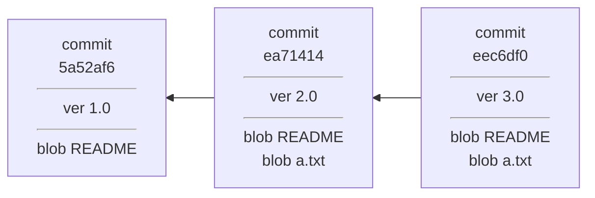
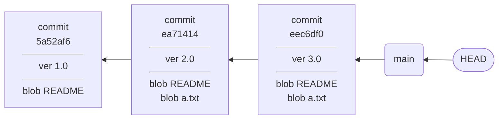
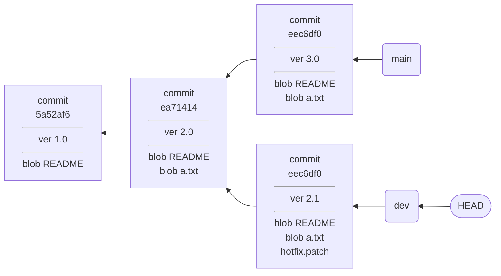
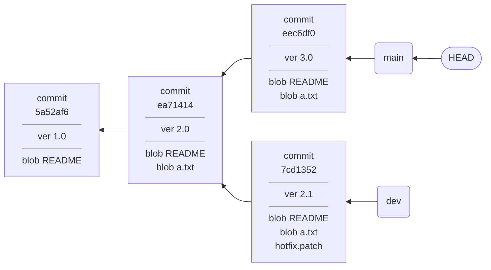
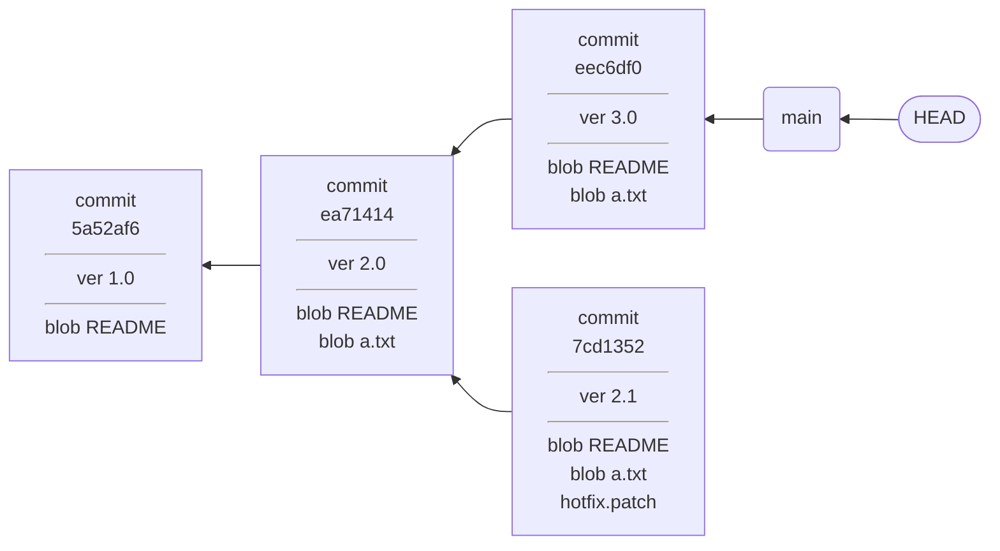

# 分支基础

> 本节部分内容参考自 [Pro Git](https://git-scm.com/book/zh/v2/Git-%E5%88%86%E6%94%AF-%E5%88%86%E6%94%AF%E7%AE%80%E4%BB%8B)，在原文基础上有一定修改。

## 什么是分支？

分支代表了一条独立的开发流水线，它从项目历史中分叉（fork）出去，当新的提交被存放在当前分支的历史后。就与原本的历史产生了区别。分支是平行进展的，当一个新的分支创建之后，如果不执行合并操作，那么它不会影响原本的分支上的工作。

这些是关于分支在上层的概念。至于 Git 管理分支的方式，要先理解 Git 管理项目历史的模型。

## Git 指针

Git 使用一种类似于反向链表的结构来组织不同版本的快照。每一个节点表示一次提交，其中包含了一个版本快照，加上一条提交消息，以及一个指向上一个版本的指针。

比如，我们这样子创建一个有三个版本的储存库：

```bash
git init
echo "Sample" > README
git add README
git commit -m "ver 1.0"

echo "2.0" > a.txt
git add a.txt
git commit -m "ver 2.0"

echo "3.0" >> a.txt
git add a.txt
git commit -m "ver 3.0"
```

那么，现在它的提交历史是这样的：



不要对「指针」这个说法感到迷惑。很多关于 Git 的书籍都采用这个说法，因为 Git 的工作原理真的非常像内存分配器。关于工作原理的仔细讨论，我们留到后面文章，这里只需要知道：**在 Git 中，有一些「Git 指针」，它们可以指向 Git 中保存的数据，比如一次提交，或者一个文件**。

## 指针和分支

有一个指针我们已经见过了。它叫做 HEAD，一般指向当前分支的最后一次提交。所以，上面那个图的完整版本应该是这样的：



这里假设当前分支的名称叫做 `main`。

从图里可以看出来，**分支实际上就是指向一次提交的指针**。而 HEAD 指针，在此时指向的是一个分支，也就是说，它是一个**二重指针**。

二重指针听起来挺唬人，但在 Git 里几重指针并没有那么重要。Git 在访问时，不论几重指针，都会反复解引用找到它实际指向的东西。HEAD 指针也不一定是二重指针，有的时候它可以直接指向一个具体的提交，至于这种情况，我们会在后面的文章中讨论。

## 分叉（fork）

这里所说的 fork 和 GitHub 的 fork 还有点不同。这里的分叉，指的是 Git 提交历史的分叉，也就是平行分支的诞生。

Git 采用反向的链表而非正向链表来记录历史，就是为了应对分叉的情形。毕竟一次提交只能基于一个历史，却可以有无数种未来发展的可能。

当分叉发生之后，历史记录会变成类似这样：



在 `ver 2.0` 之后，发生了分叉，出现了一个新的分支 `dev`，这个分支和原本的 `main` 分支是平行进展的。HEAD 指针指向 `dev`，表示当前正在 `dev` 分支上工作。

## 切换分支

在切换分支时，发生了两件事情：**HEAD 指针指向新的分支，随后工作树的内容会变成新切换的分支指向的快照**。

分叉之后，我们切换到原本的 `main` 分支：



看起来几乎没有什么变化。这就是 Git 分支轻量快速的原因。

## 删除分支

删除分支，真的只是删除“分支”本身。Git 只会删掉分支的指针，别的都不会变。

比如说，我们删掉 `dev` 分支：



现在指向 `7cd1352` 这次提交的指针消失了。但是等等，这次提交还保存着一个快照，不是在浪费我们的空间吗？

没错。所以 Git 会提醒你，**`dev` 分支的工作没有完全并入主分支，这时删除需要谨慎**。你可以用命令来强制删除 `dev` 分支，那么 `7cd1352` 这次提交就无法被任何分支访问了。

这种不可及的快照，会被 Git 的垃圾回收机制删除。这是 Git 工作起来确实像一个内存分配器的另一个表现。关于垃圾回收机制，我们会在后续的文章展开讲解。
