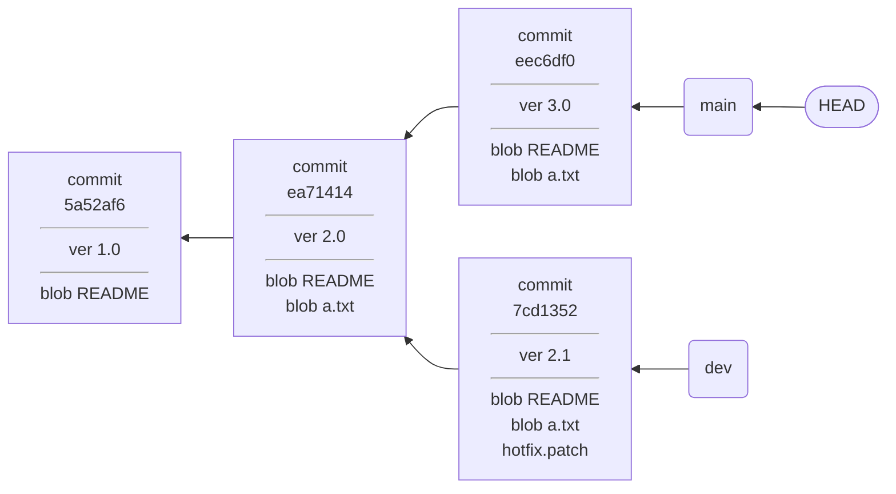
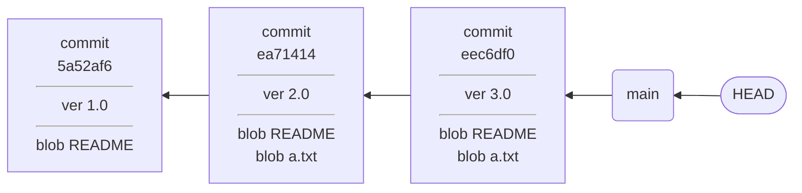
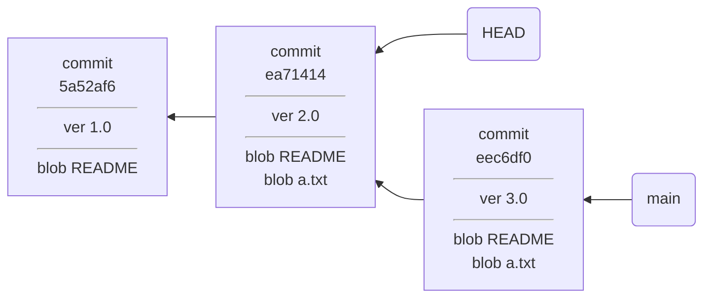
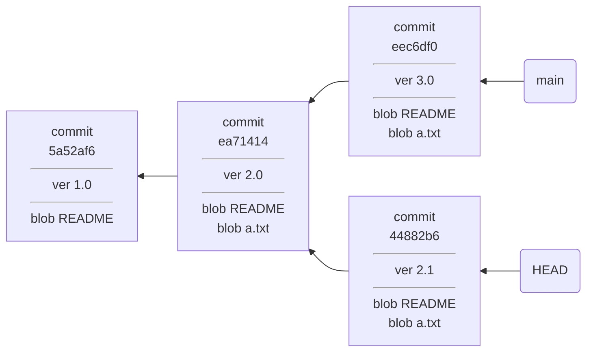

# 创建和切换分支

> 本节部分内容参考自 git-recipes 的[《检出以前的提交》](https://github.com/geeeeeeeeek/git-recipes/blob/revision-2018/sources/2.5-%E6%A3%80%E5%87%BA%E4%BB%A5%E5%89%8D%E7%9A%84%E6%8F%90%E4%BA%A4.md)和[《使用分支》](https://github.com/geeeeeeeeek/git-recipes/blob/revision-2018/sources/3.4-%E4%BD%BF%E7%94%A8%E5%88%86%E6%94%AF.md)，在原文基础上有一定修改。

## git switch

`git switch` 命令用于切换和创建分支。

### 切换分支

在一条分支上的工作完成后，要到其他分支进行别的工作，此时需要切换分支。切换分支的命令为：

```
git switch <branch-name>
```

其中，`<branch-name>` 为要切换到的分支的名称。

切换分支前，需要先检查当前分支中已跟踪的文件是否有未暂存的修改，如果有，则需要将修改暂存或临时储藏。未跟踪或已暂存的修改不会影响切换分支，除非切换时会导致这些修改被覆盖。

在不冲突的情况下，已暂存的修改在分支切换后保持不变。这允许先作出修改，然后切换分支，已经做出的修改会被带到新的分支。这一特性在某些工作流（见以后章节）中会很有用。

> 和 `git revert` 一样，`git switch` 也是一条很新的命令，甚至目前为止它的行为还没有稳定。在旧版本中，切换分支的命令为 `git checkout <branch-name>`。

### 创建分支

`git switch <branch-name>` 不能切换到一个不存在的分支，要创建一个新的分支，可以使用 `-c` 选项：

```
git switch -c <branch-name>
```

`<branch-name>` 为新分支的名称。这条命令会在创建新分支的同时切换过去。

`-c` 选项只用于创建新分支。如果 `<branch-name>` 已存在，则会报错。

新创建的分支将会和当前的 HEAD 有相同的内容。从底层看，其原理就是新建一个指向 HEAD 指向的内容的分支指针，然后将 HEAD 指向它。

同样，新创建分支会保留暂存区中的修改。

> 在旧版本中，创建并切换分支的命令为 `git checkout -b <branch-name>`。

### 从某一点创建分支

默认情形下，`git switch -c` 创建的分支会基于当前的 HEAD。其实，还可以指定一个额外的参数 `<start-point>`，指定从历史中的某一点创建分支：

```
git switch -c <branch-name> <start-point>
```

这里的 `<start-point>` 采用一种 Git 专用的选择提交历史的语法，大致的语法有以下几种：

1. `<branch-name>` 表示某个分支指针指向的提交。
2. `<commit-id>` 为某个提交的哈希值的前几位（在无歧义的情况下至少 4 位）。
3. `<tag-name>` 表示某个标签所在的提交。
4. `HEAD` 表示 HEAD 指向的提交。
5. `<start-point>~N` 表示某个提交的第 N 级父提交。
6. `@{-N}` 倒数第 N 次使用同一命令时指定的提交。可用 `-` 作为 `@{-1}` 的简写。
7. `A...B` 两个提交的最近共同祖先，若省略一端，视为 `HEAD`。

这些语法经常被用在各种需要指定一次提交的地方。不过，在不同命令里，这些语法并非都是可用的，一般前五条对大多数命令都是可用的。



以上图为例，要想指向 `ea71414` 这次提交，可以使用以下的方式：`ea71` `HEAD~1` `main~1` `main...dev`。

## git branch

`git branch` 是**管理分支**用的命令，它允许你创建、列出、重命名和删除分支，但没有修改工作树和历史记录的功能，因此不能切换和合并分支。

### 详细用法

```
git branch
```

列出仓库中所有分支。

```
git branch <branch>
```

创建一个名为 `<branch>` 的分支。不会自动切换到那个分支去。

```
git branch <branch> <start-point>
```

从 `<start-point>` 创建分支。

```
git branch -d <branch>
```

删除指定分支。这是一个安全的操作，Git 会阻止你删除包含未合并更改的分支。

```
git branch -D <branch>
```

强制删除指定分支，即使包含未合并更改。如果你希望永远删除某条开发线的所有提交，你应该用这个命令。

```
git branch -m <branch>
```

将当前分支命名为 `<branch>`。

## 签出

在[之前的章节](../储存库/创建储存库.md)，我们简单提及了「签出」的概念：从储存库中提取文件，释放到工作树中的过程，称为签出。

切换分支的过程会发生签出。在切换分支时，实际上发生了两个操作：**将 HEAD 指针指向目标分支**，然后**签出当前的 HEAD**。

### git checkout

`git checkout` 是用于进行签出的命令，它有两种功能：签出某个文件，签出以前的提交。

签出提交会使工作目录和这个提交完全匹配。你可以用它来查看项目之前的状态，而不改变当前的状态。

签出文件使你能够查看某个特定文件的旧版本，而工作目录中剩下的文件不变。

#### 详细用法

```
git checkout <start-point>
```

签出 `<start-point>` 指定的提交。同上面的规则一样，`<start-point>` 可以是一个分支名、提交，或者表示提交的表达式。这条命令会使 HEAD 指向签出的提交，并且更新工作目录中的所有文件，使得和某个特定提交中的文件一致。

```
git checkout <start-point> <file>
```

查看文件之前的版本。它将工作目录中的 `<file>` 文件变成 `<start-point>` 中那个文件的拷贝，并将它加入缓存区。

```
git checkout -- <file>
```

从 HEAD 签出某个文件。这表现为放弃这个文件在工作目录中的修改，并将它从缓存区中删除。`--` 是为了消除命令歧义，否则 Git 会把文件名识别为提交的表示。

```
git checkout -b <branch>
```

从 HEAD 创建一个新的分支，并签出它。这等同于 `git switch -c <branch>`。

### 分离头部

“分离头部”是英文 *Detached Head* 的直译，它完整的含义是：**HEAD 指针从一个分支上分离**。

大多数时候，HEAD 指针是一个二级指针，它指向一个分支，表示当前进行的工作所在的分支。



如果 HEAD 从一个分支上分离，直接指向一个提交，那么 HEAD 就从二重指针变成了一重指针：



这种 HEAD 直接指向一个提交的情况，就叫做 Detached Head。

产生 Detached Head 的原因，是签出了一个不是某一分支最新提交的提交，比如用 `git checkout <commit-id>` 直接指定一个提交进行签出。

在 Detached Head 状态下，更改、暂存等对工作树的操作都是可以进行的。提交也可以进行，这会导致一段新的历史被分叉出去。比如，在上面的图中，再发起一次提交：



新的提交产生后，HEAD 指向了新的提交，但是仍然出于 Detached Head 状态。如果此时试图签出 `main` 分支，Git 会提醒你，之前所在的提交记录没有任何分支指向它。

```
$ git checkout main
Warning: you are leaving 1 commit behind, not connected to
any of your branches:

  44882b6 ver 2.1

If you want to keep it by creating a new branch, this may be a good time
to do so with:

 git branch <new-branch-name> 44882b6

Switched to branch 'main'
```

按照提示，可以用 `git branch` 新建一个分支，保存在 Detached Head 时做出的变更。如果此时不建立分支，那么这个提交将只能通过哈希值来访问。假如忘记了哈希值，那么这里的发生的变更将会永远无法找回。（事实上，还是有 `reflog` 这种补救措施的。）
