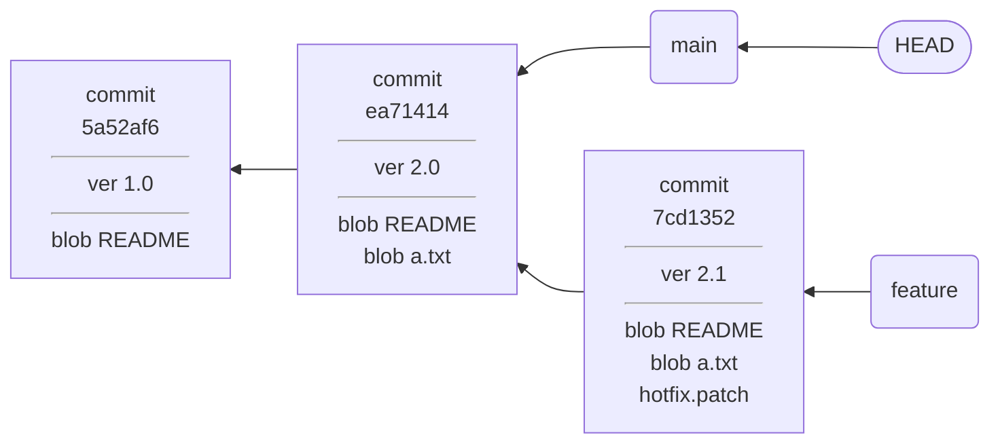
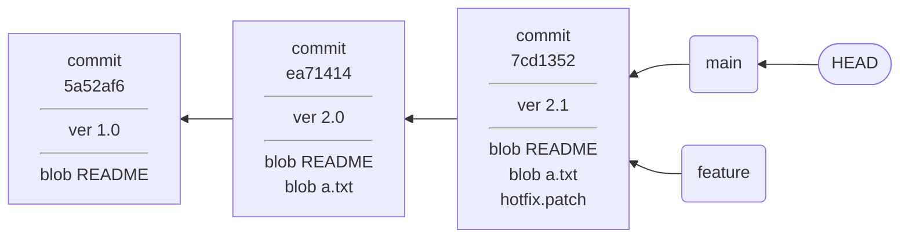
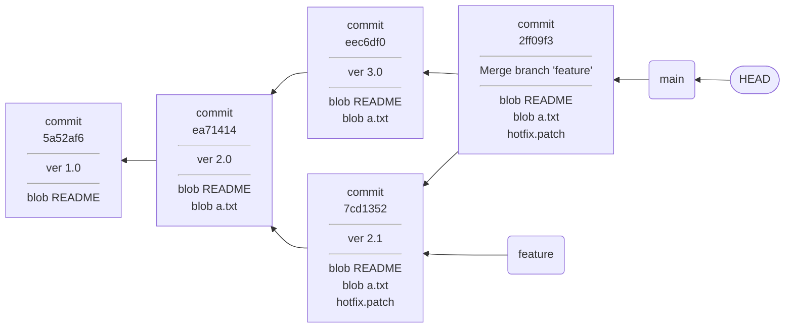
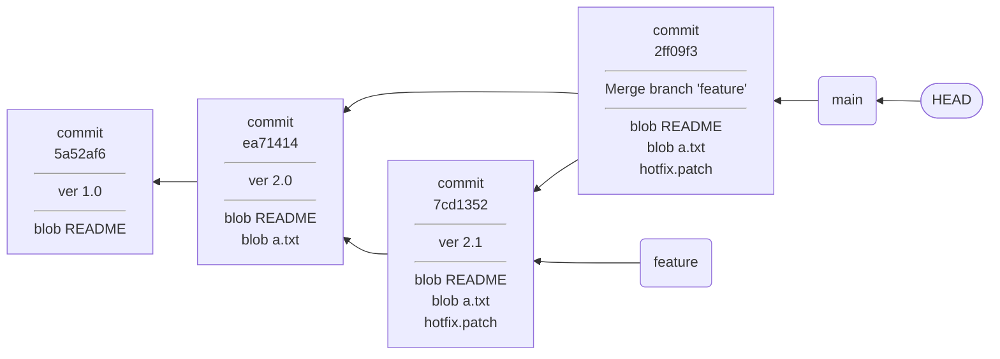
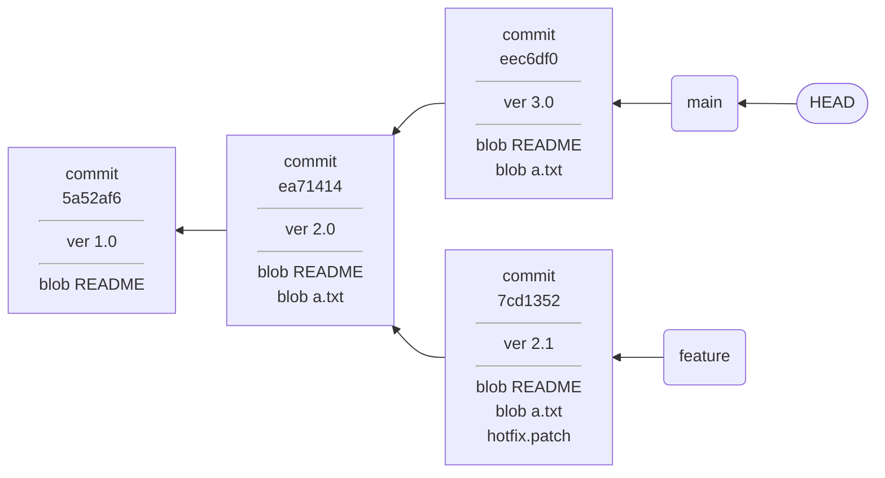
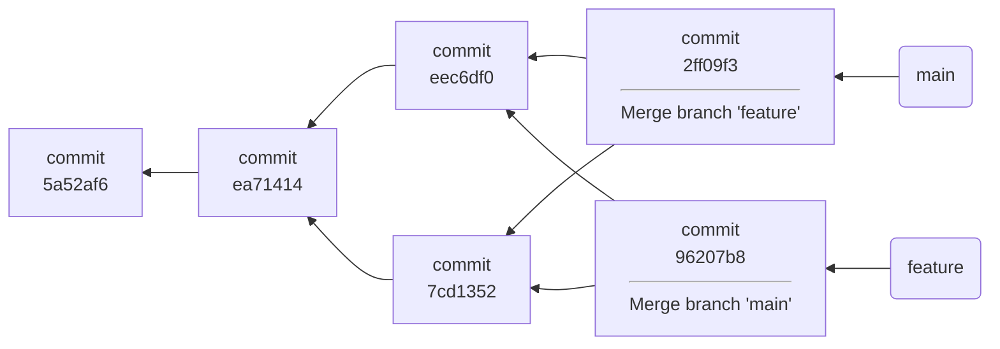

# 合并分支

> 本节部分内容参考自 [Git Reference](https://git-scm.com/docs/merge-strategies)，在原文基础上有一定修改。

## git merge

想象你用 `git switch -c` 创建了一个新的分支，这个分支的历史从此就和主分支分道扬镳了。如果分支只能新建，不能合并，那么项目的历史就会越来越复杂，这不是一个合格的版本控制系统应该有的行为。Git 允许你将一个分支合并入另一个分支，以此宣告一个分支的使命终结。

在Git中，`git merge` 是将分支历史重新结合的主要方式。

一个典型的场景是，当你在特性分支上完成开发后，通常需要将其合并回主分支。这种情况下，需要先切换到主分支，然后在主分支上执行 `git merge` 命令。

```shell
git switch main
git merge feature
```

这个操作会将 feature 分支的内容合并到当前所在的 main 分支。

为什么要先切换到主分支？Git 约定的操作逻辑是：**你在当前分支上执行的命令，都是针对当前分支的**。将特性分支的内容合并到主分支是对主分支内容的修改，因此需要先切换到主分支。

## 合并的两种方式

根据分支历史的不同，合并会产生两种结果：

第一种情况，当目标分支是被合并分支的直接上游时，此时发生的是**快进合并(Fast-forward)**。例如，这是合并前的分支状态：



将 feature 分支以快进合并的方式合并到 main 分支后，分支状态变为：



第二种情况，如果两个分支在分叉之后，各自都有新提交，则会创建**合并提交(merge commit)**。例如，这是合并前的分支状态：


将 feature 分支合并入 main 分支后，分支状态变为：



两种合并最大的区别，在于是否会有合并提交产生。合并提交是一种特殊的提交，与普通提交不同，它有**多个父提交**（回忆一下普通提交以反向链表的形式记录历史）。合并提交的作用是将多个分支的历史重新结合在一起，形成一条新的历史线。

这两种合并之间的区别也不是绝对的，你可以使用命令行参数来告诉 Git 你希望使用哪种方式来合并分支。

```shell
git merge --ff-only feature  # 仅允许快进合并
git merge --no-ff feature   # 禁止快进合并，强制创建合并提交
```

因为快进合并并非总是可用的，如果确实存在被分叉的历史，必须有合并提交才能将分支重新结合在一起。如果此时指定了`--ff-only`，Git 会拒绝合并操作，不会对分支历史进行任何修改。

而如果在可以快进合并的情况下，使用`--no-ff`参数禁止快进合并，Git 会强制创建一个合并提交。与快进合并相比，这样可以在历史中记录这一次合并的存在（否则快进合并在历史中是没有记录的），但代价是分支历史不再是线性的了。



## 三路合并

当合并提交被记录入历史，意味着两个分支上不同的修改被重新结合在一起，成为一个统一的文件快照。之后继续在此分支上开发，都将基于这个被结合的快照进行。这个快照被记录在合并提交中，成为这个提交的内容。

那么，Git 是如何计算两个分支下，不同的文件结合之后的结果的呢？Git 使用了一种叫做**三路合并**（three-way merge）的算法。

### 三路合并的原理

三路合并的核心思想是：**在合并两个分支时，Git 会找到这两个分支的共同祖先（merge base），然后将这个共同祖先与两个分支的最新提交进行比较**。

当执行 `git merge feature` 时：

1. **定位共同祖先**：Git首先找到当前分支和被合并分支最近的共同提交（merge base）。

2. **分析差异**：

   - 计算从共同祖先到当前分支末端的变更（ours）；
   - 计算从共同祖先到 feature 分支末端的变更（theirs）。

3. **整合变更**：

   - 如果只有一方修改了某个文件，直接使用该方的修改；
   - 如果双方都修改了同一文件，尝试使用 diff 算法自动合并，如果不能自动合并，标记为**合并冲突**，等待用户手动解决。

4. **创建合并提交**：当所有冲突解决后，Git 会创建合并提交，记录合并的结果。

例如，这是合并前的分支状态：



将 feature 分支合并入 main 分支时，Git 会找到共同祖先 `ea71414`，然后计算出两个分支相对于共同祖先的变更。假如两个分支的变更如下：

```bash
# main 分支的变更
M README
M a.txt

# feature 分支的变更
M README
A hotfix.patch
```

那么，Git 将会保留 main 分支的 `a.txt` 和 feature 分支的 `hotfix.patch`，并尝试将两个分支的 `README` 合并在一起。最终的合并结果如下：

```bash
README # 合并后的文件
a.txt # main 分支的文件
hotfix.patch # feature 分支的文件
```

### 合并策略

三路合并中，最重要的一步是寻找共同祖先。因为合并提交的存在，Git 的历史不再是一棵树，而是一个有向无环图（DAG）。在这个图中，两个分支的共同祖先可能不止一个，一个典型的场景是当两个分支互相合并时：



在这个场景下，因为 `main` 和 `feature` 分支互相合并，导致它们存在两个共同祖先：`eec6df0` 和 `7cd1352`。这种情况下，Git 会先对多个共同祖先进行一次三路合并，得到一个虚拟的提交，以此为基础进行后续的合并。这个虚拟提交不会被记录在历史中，但它的存在是为了让 Git 能够正确地计算出两个分支的差异。

因为寻找共同祖先的过程也是一次递归的三路合并，所以这一合并策略被称为 `recursive`，长期以来，一直是 Git 的默认合并策略。后来 Git 将 `recursive` 升级为 `ort` 策略，但其基本思想没有变化。`ort` 策略在 `recursive` 的基础上，优化了对文件重命名的支持，并且改良了在大型项目中的性能。

Git 还支持其他不同的合并策略，那些策略就不再基于三路合并了。比如 `octopus` 策略允许你同时合并多个分支，但不支持冲突解决；`ours` 策略会忽略被合并分支的所有修改，只保留当前分支的修改；`subtree` 策略则是将被合并分支的内容嵌入到当前分支中。这些策略的使用场景比较少见，通常在一些特殊的情况下才会用到。

### 三路合并的不足

三路合并的算法在大多数情况下都能很好地工作，但也有一些不足之处：合并时只参考了两个分支的最新提交和它们的共同祖先，而忽略了其他的历史提交。这可能导致一些意外的合并结果。

例如，两个分支的历史分叉之后，各自独立地进行了一项相同的修改，但后来在其中一个分支上撤销了该更改，那么该更改仍会出现在合并结果中；有些人会觉得这种行为令人困惑。其原因在于合并时只考虑最新版本，而不考虑历史中的变化。因此，合并算法将撤销的更改视为没有更改，并替换为已更改的版本。
